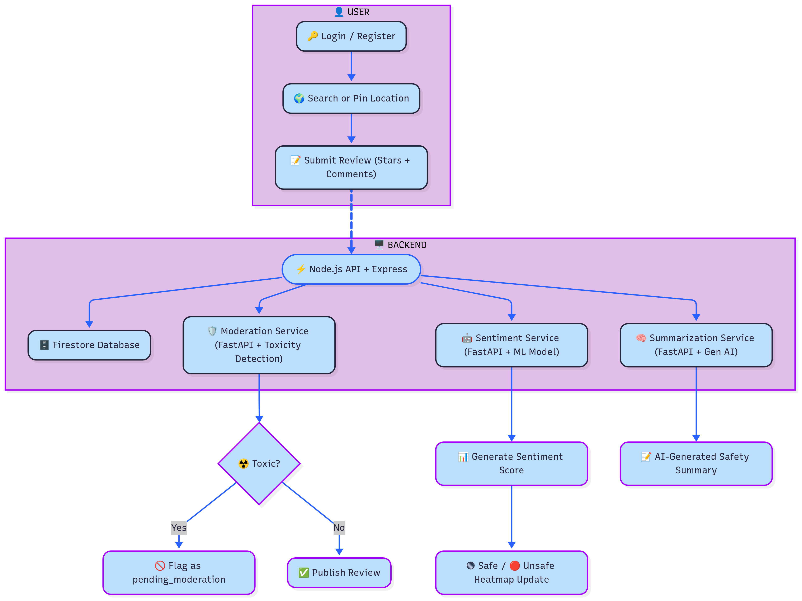

<!-- # Sentinel - AI-Powered Crowdsourced Safety Heatmap Platform

**Sentinel** is a full-stack, microservice-based web application designed to provide real-time, crowd-sourced safety information. By leveraging AI for sentiment analysis and content moderation, Sentinel generates dynamic safety heatmaps, allowing users to make informed decisions about their environment.

[](#) 
*(**Note:** Once the project is done, record a short GIF of you using the app and replace the link above. This is highly recommended!)*

---

## 🚀 Key Features

*   **Interactive Heatmap:** Visualizes safety scores across geographic areas, rendered in real-time based on user-submitted reviews.
*   **Crowd-Sourced Reviews:** Users can submit detailed safety reviews, including a rating and qualitative feedback.
*   **AI-Powered Sentiment Analysis:** A dedicated Python microservice analyzes the sentiment of each review, generating a quantitative score that powers the heatmap.
*   **AI-Generated Summaries:** A Generative AI microservice provides concise, human-readable safety summaries for any selected area based on collective reviews.
*   **Automated Content Moderation:** A toxicity detection microservice automatically flags and hides inappropriate content to maintain platform integrity.
*   **Secure User Authentication:** Full user registration and login system, with protected routes for submitting reviews and managing user-specific content.
*   **User Profiles & Review Management:** Personalized profile pages where users can view and track their own submission history and moderation status.
*   **Community-Driven Voting System:** Users can upvote or downvote reviews to highlight the most helpful and relevant safety information.

---

## 🛠️ Tech Stack & Architecture

This project is built using a modern, scalable **microservices architecture**. This separates concerns, allows for independent service scaling, and facilitates a polyglot technology stack.

### **System Architecture Diagram**
*(A simple diagram can greatly enhance your README. You can create one easily using tools like [Excalidraw](https://excalidraw.com/) or Mermaid syntax.)*
```mermaid
graph TD
    A[User Browser] --|HTTP/S| B(React Frontend);
    B --|API Calls| C(Node.js Backend Gateway);
    C --|CRUD| D(Firebase Firestore DB);
    C --|Analysis Req| E(Sentiment Inference Service);
    C --|Summary Req| F(Summarization Service);
    C --|Moderation Req| G(Moderation Service);

    subgraph "Frontend"
        B
    end
    subgraph "Backend"
        C
    end
    subgraph "Database"
        D
    end
    subgraph "AI Microservices (Python/FastAPI)"
        E
        F
        G
    end
```

### **Technologies Used**

*   **Frontend:** React, Vite, React Leaflet, `react-router-dom`
*   **Backend:** Node.js, Express.js
*   **Database:** Firebase Firestore (NoSQL)
*   **AI Microservices:** Python, FastAPI
*   **Machine Learning:** Hugging Face Transformers, PyTorch, Scikit-learn
*   **Authentication:** Firebase Authentication
*   **Deployment & DevOps (Planned):** Docker, Docker Compose, GitHub Actions, Google Cloud Run

---

## 🏃‍♂️ Getting Started

### Prerequisites

*   Node.js (v20.11+ or v22.2+)
*   Python (v3.8+)
*   Firebase Project with Firestore and Authentication enabled.

### Local Development Setup

1.  **Clone the repository:**
    ```bash
    git clone https://github.com/YourUsername/sentinel-platform.git
    cd sentinel-platform
    ```

2.  **Setup Backend:**
    ```bash
    cd backend
    npm install
    # Add your Firebase serviceAccountKey.json to /src/config
    npm start
    ```
    *The backend server will run on `http://localhost:5000`.*

3.  **Setup AI Microservices:**
    *For each service (`sentiment-inference`, `summarization`, `moderation`):*
    ```bash
    cd services/<service_name>
    python -m venv venv
    source venv/bin/activate
    pip install -r requirements.txt # (You'll need to create this file)
    uvicorn main:app --reload --port <port_number>
    ```
    *   Sentiment Service: Port `8000`
    *   Summarization Service: Port `8001`
    *   Moderation Service: Port `8002`

4.  **Setup Frontend:**
    ```bash
    cd frontend
    npm install
    # Add your Firebase client-side config to src/firebase.js
    npm run dev
    ```
    *The frontend will be available at `http://localhost:5173`.*

---

## 🔮 Future Implementations

This project is under active development. Future phases will include:

*   **Phase 12: Proactive Safety Notifications:** An event-driven alert system to warn users about low-safety areas.
*   **Phase 13: Full Containerization:** Encapsulating each service in Docker for simplified setup and consistent environments.
*   **Phase 14: CI/CD Automation:** Implementing a complete CI/CD pipeline with GitHub Actions for automated testing and deployment to Google Cloud Run.

---

## License

This project is licensed under the MIT License. See the [LICENSE](LICENSE) file for details. -->

# 🔐 Sentinel – AI-Powered Crowdsourced Safety Heatmap Platform

**Sentinel** is a **full-stack, microservice-based web application** that provides **real-time, crowd-sourced safety insights**. By combining **AI-driven sentiment analysis**, **Generative AI summaries**, and **dynamic geospatial visualization**, Sentinel empowers users to make **safer, smarter decisions** about their environment.

> 🌟 **A portfolio-ready capstone project integrating frontend, backend, AI/ML, and cloud-ready architecture with real-world impact.**

---

## 🎥 Live Demo

> _Once you record a short GIF of the live app (login → search/pin → submit review → heatmap update → AI summary → moderation) replace this placeholder with the actual GIF._

---

## 💡 Motivation & Impact

Sentinel was built to **bridge the gap between technology and community safety**, showcasing an end-to-end integration of **frontend, backend, and AI/ML**.

- **AI/ML-Powered Insights:**
  - **Sentiment Analysis:** Converts user reviews into a **quantitative sentiment score** (+1 = positive, -1 = negative).
  - **Generative AI Summaries:** Aggregates reviews to create **concise, human-readable summaries** of safety at any location.

- **Community & Public Utility:**
  - Provides **real-time safety maps** for citizens.
  - Includes **moderation mechanisms** to ensure safe, accurate community contributions.
  - Potential for **government partnerships** for urban safety and law enforcement surveillance.

- **Portfolio Significance:**
  - Demonstrates full-stack development (React + Node.js + Firebase) and AI integration.
  - Highlights **real-world problem-solving** and **social impact potential**.

> _Sentinel turns crowdsourced data into actionable safety intelligence._

---

## 🚀 Features

### 🌍 Map & Heatmap
- Users can **search or pin locations** on the map.
- Submit **safety reviews** with:
  - Star rating (out of 5)
  - Pre-filled prompts + additional comments
- Heatmap color-coded by sentiment score:
  - **Green** = positive
  - **Red** = negative

### 🤖 AI-Powered Microservices
- **Sentiment-Inference Service:** ML model scores reviews from +1 to -1.
- **Summarization Service:** Gen AI summarizes all reviews for the selected area.
- **Moderation Service:** Detects toxic or inappropriate content; flags reviews as `pending_moderation` until approved.

### 📝 Community & User Features
- Secure user login with **Firebase Authentication**.
- Personalized **user profiles** with review history and moderation status.
- **Upvote/Downvote system** to highlight helpful reviews.

---

## 🛠 Architecture & Tech Stack

<!--
### 🔗 System Architecture (Microservices)

---
config:
  theme: redux
  look: neo
  layout: dagre
---
flowchart TD
 subgraph USER["👤 USER"]
        A["🔑 Login / Register"]
        B["🌍 Search or Pin Location"]
        C["📝 Submit Review (Stars + Comments)"]
  end
 subgraph BACKEND["🖥️ BACKEND"]
        D["⚡ Node.js API + Express"]
        E["🗄️ Firestore Database"]
        F["🛡️ Moderation Service (FastAPI + Toxicity Detection)"]
        G["🤖 Sentiment Service (FastAPI + ML Model)"]
        H["🧠 Summarization Service (FastAPI + Gen AI)"]
    end
    %% Flows
    A --> B --> C
    C ==> D
    D --> E & F & G & H

    %% Moderation Path
    F --> I{"☢️ Toxic?"}
    I -- Yes --> J["🚫 Flag as pending_moderation"]
    I -- No --> K["✅ Publish Review"]

    %% Sentiment + Summary
    G --> L["📊 Generate Sentiment Score"]
    L --> M["🟢 Safe / 🔴 Unsafe Heatmap Update"]
    H --> N["📝 AI-Generated Safety Summary"]
    B@{ shape: rounded}
    A@{ shape: rounded}
    C@{ shape: rounded}
    D@{ shape: terminal}
    E@{ shape: rounded}
    F@{ shape: rounded}
    G@{ shape: rounded}
    H@{ shape: rounded}
    J@{ shape: rounded}
    K@{ shape: rounded}
    L@{ shape: rounded}
    M@{ shape: rounded}
    N@{ shape: rounded}
    style B fill:#BBDEFB
    style A fill:#BBDEFB
    style C fill:#BBDEFB
    style D stroke:#2962FF,fill:#BBDEFB
    style E fill:#BBDEFB
    style F fill:#BBDEFB
    style G fill:#BBDEFB
    style H fill:#BBDEFB
    style I fill:#BBDEFB,stroke:#AA00FF,stroke-width:2px,stroke-dasharray: 0
    style J fill:#BBDEFB,stroke:#AA00FF
    style K fill:#BBDEFB,stroke:#AA00FF
    style L fill:#BBDEFB,stroke:#AA00FF,stroke-width:2px,stroke-dasharray: 0
    style M fill:#BBDEFB,stroke:#AA00FF
    style N fill:#BBDEFB,stroke:#AA00FF,stroke-width:2px,stroke-dasharray: 0
    style USER stroke:#AA00FF,color:#000000,fill:#E1BEE7
    style BACKEND stroke:#AA00FF,fill:#E1BEE7
    linkStyle 0 stroke:#2962FF,fill:none
    linkStyle 1 stroke:#2962FF,fill:none
    linkStyle 2 stroke:#2962FF,fill:none
    linkStyle 3 stroke:#2962FF,fill:none
    linkStyle 4 stroke:#2962FF,fill:none
    linkStyle 5 stroke:#2962FF,fill:none
    linkStyle 6 stroke:#2962FF,fill:none
    linkStyle 7 stroke:#2962FF,fill:none
    linkStyle 8 stroke:#2962FF,fill:none
    linkStyle 9 stroke:#2962FF,fill:none
    linkStyle 10 stroke:#2962FF,fill:none
    linkStyle 11 stroke:#2962FF,fill:none
    linkStyle 12 stroke:#2962FF,fill:none
    L_C_D_0@{ animation: fast } 
    L_F_I_0@{ animation: none } 
    L_G_L_0@{ animation: none } 
    L_H_N_0@{ animation: none } 
-->


    ## 🔗 System Architecture



**Diagram Explanation:**
1. **User Flow:** Login → Search/Pin location → Submit review
2. **Backend Flow:** Review goes through API → Database → AI microservices
3. **Moderation:** Toxic reviews are flagged and hidden until approved
4. **AI Services:**
   - Sentiment Analysis → Heatmap update (Red/Green)
   - Generative Summarization → Display AI-generated summary
5. **End Result:** Users see a **color-coded heatmap** + **AI summary** for safety decision-making

### ⚙️ Technologies
- **Frontend:** React, Vite, React Leaflet, react-router-dom  
- **Backend:** Node.js, Express.js  
- **Database:** Firebase Firestore (NoSQL)  
- **AI Microservices:** Python, FastAPI  
- **Machine Learning:** Hugging Face Transformers, PyTorch, Scikit-learn  
- **Authentication:** Firebase Authentication  
- **Deployment (Planned):** Docker, Docker Compose, GitHub Actions, Google Cloud Run  

---

## 🏃 Getting Started

### ✅ Prerequisites
- Node.js (v20.11+ or v22.2+)  
- Python (v3.8+)  
- Firebase project with **Firestore + Authentication** enabled  

### ⚡ Local Development Setup

1. **Clone the repository**
```bash
git clone https://github.com/YourUsername/sentinel-platform.git
cd sentinel-platform
```

2. **Setup Backend**
```bash
cd backend
npm install
# Add Firebase serviceAccountKey.json to /src/config
npm start
```
Backend runs at: **http://localhost:5000**

3. **Setup AI Microservices**
```bash
cd services/<service_name>
python -m venv venv
source venv/bin/activate
pip install -r requirements.txt
uvicorn main:app --reload --port <port_number>
```
- Sentiment Service → `:8000`  
- Summarization Service → `:8001`  
- Moderation Service → `:8002`

4. **Setup Frontend**
```bash
cd frontend
npm install
# Add Firebase client config to src/firebase.js
npm run dev
```
Frontend runs at: **http://localhost:5173**

---

## 🔮 Roadmap & Future Enhancements
- **Proactive Safety Notifications:** Real-time alerts for low-safety areas.  
- **Full Containerization:** Dockerize all services for consistent deployments.  
- **CI/CD Pipeline:** GitHub Actions + Google Cloud Run deployment.  
- **Community Integration:** Partner with local authorities and civic organizations.  

---

## 📂 Project Structure
```
sentinel-platform/
│── backend/                # Node.js Express backend
│── frontend/               # React + Vite frontend
│── services/               # AI microservices
│    ├── sentiment-inference/
│    ├── summarization/
│    └── moderation/
│── docs/                   # System diagrams & documentation
│── LICENSE
│── README.md
```

---

## 📜 License
MIT License – see [LICENSE](./LICENSE)

---

## 🌟 Why Sentinel Stands Out
- ✅ **Full-stack + AI/ML integration:** End-to-end implementation.  
- ✅ **Real-world impact:** Crowd-sourced safety insights, moderated for reliability.  
- ✅ **Portfolio-ready:** Demonstrates modern technologies, microservices, and cloud-readiness.  
- ✅ **Social value:** Can be extended to government/public safety collaboration.  

> _Sentinel is a working, production-like platform turning data into actionable safety intelligence._

