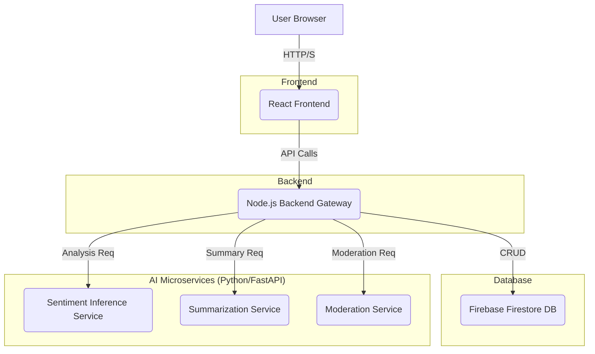

# Sentinel - AI-Powered Safety Heatmap Platform

**Sentinel** is a full-stack, microservice-based web application designed to provide real-time, crowd-sourced safety information. By leveraging AI for sentiment analysis and content moderation, Sentinel generates dynamic safety heatmaps, allowing users to make informed decisions about their environment.

[](#) 
*(**Note:** Once the project is done, record a short GIF of you using the app and replace the link above. This is highly recommended!)*

---

## 🚀 Key Features

*   **Interactive Heatmap:** Visualizes safety scores across geographic areas, rendered in real-time based on user-submitted reviews.
*   **Crowd-Sourced Reviews:** Users can submit detailed safety reviews, including a rating and qualitative feedback.
*   **AI-Powered Sentiment Analysis:** A dedicated Python microservice analyzes the sentiment of each review, generating a quantitative score that powers the heatmap.
*   **AI-Generated Summaries:** A Generative AI microservice provides concise, human-readable safety summaries for any selected area based on collective reviews.
*   **Automated Content Moderation:** A toxicity detection microservice automatically flags and hides inappropriate content to maintain platform integrity.
*   **Secure User Authentication:** Full user registration and login system, with protected routes for submitting reviews and managing user-specific content.
*   **User Profiles & Review Management:** Personalized profile pages where users can view and track their own submission history and moderation status.
*   **Community-Driven Voting System:** Users can upvote or downvote reviews to highlight the most helpful and relevant safety information.

---

## 🛠️ Tech Stack & Architecture

This project is built using a modern, scalable **microservices architecture**. This separates concerns, allows for independent service scaling, and facilitates a polyglot technology stack.

### **System Architecture Diagram**
*(A simple diagram can greatly enhance your README. You can create one easily using tools like [Excalidraw](https://excalidraw.com/) or Mermaid syntax.)*


### **Technologies Used**

*   **Frontend:** React, Vite, React Leaflet, `react-router-dom`
*   **Backend:** Node.js, Express.js
*   **Database:** Firebase Firestore (NoSQL)
*   **AI Microservices:** Python, FastAPI
*   **Machine Learning:** Hugging Face Transformers, PyTorch, Scikit-learn
*   **Authentication:** Firebase Authentication
*   **Deployment & DevOps (Planned):** Docker, Docker Compose, GitHub Actions, Google Cloud Run

---

## 🏃‍♂️ Getting Started

### Prerequisites

*   Node.js (v20.11+ or v22.2+)
*   Python (v3.8+)
*   Firebase Project with Firestore and Authentication enabled.

### Local Development Setup

1.  **Clone the repository:**
    ```bash
    git clone https://github.com/YourUsername/sentinel-platform.git
    cd sentinel-platform
    ```

2.  **Setup Backend:**
    ```bash
    cd backend
    npm install
    # Add your Firebase serviceAccountKey.json to /src/config
    npm start
    ```
    *The backend server will run on `http://localhost:5000`.*

3.  **Setup AI Microservices:**
    *For each service (`sentiment-inference`, `summarization`, `moderation`):*
    ```bash
    cd services/<service_name>
    python -m venv venv
    source venv/bin/activate
    pip install -r requirements.txt # (You'll need to create this file)
    uvicorn main:app --reload --port <port_number>
    ```
    *   Sentiment Service: Port `8000`
    *   Summarization Service: Port `8001`
    *   Moderation Service: Port `8002`

4.  **Setup Frontend:**
    ```bash
    cd frontend
    npm install
    # Add your Firebase client-side config to src/firebase.js
    npm run dev
    ```
    *The frontend will be available at `http://localhost:5173`.*

---

## 🔮 Future Implementations

This project is under active development. Future phases will include:

*   **Phase 12: Proactive Safety Notifications:** An event-driven alert system to warn users about low-safety areas.
*   **Phase 13: Full Containerization:** Encapsulating each service in Docker for simplified setup and consistent environments.
*   **Phase 14: CI/CD Automation:** Implementing a complete CI/CD pipeline with GitHub Actions for automated testing and deployment to Google Cloud Run.

---

## License

This project is licensed under the MIT License. See the [LICENSE](LICENSE) file for details.